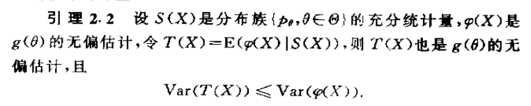

# AdvancedStatistics-Review
高等统计学复习

## 知识点地图

- 基本概念
  - 统计结构
    - 统计结构
        - 定义1.1
          - 
    - 乘积结构与重复抽样结构
    - 可控结构
  - 常用分布族
    - Gamma分布族  
        - 定义1.6
          - 
    - Beta分布族
        - 定义1.7
          - 
    - Fisher Z分布族
        - 定义1.8
          - 
    - t分布族
        - 定义1.9
          - 
    - 多项分布族
    - 多元正态分布族
    - 几个非中心分布族
  - 统计量及其分布
    - 统计量
        - 定义1.14
          - 
    - 多项分布族
    - 抽样分布
      - 统计量的分布，由于经常使用雅克比变化，又称诱导分布
    - 来自正态总体的抽样分布
    - 次序统计量及其分布
      - 
      - 
  - 统计量的近似分布
    - 从中心极限定理获得渐进分布
      - 
    - 随机变量序列的两种收敛性
      - 
      - 
      - 
      - 
    - 几个重要的结构
    - 样本的p分位数及其渐进分布
  - 充分统计量
    - 统计量的压缩数据功能
      - 
    - 充分性
    - 因子分解定理
      - 
    - 最小充分统计量
      - 
  - 完备性
    - 分布族的完备性
      - 
    - 完备统计量
      - 
  - 指数结构
    - 定义与例子
    - 指数分布族的标准性质
    - 指数型分布族的标准形式
    - 指数型分布族的基本性质
- 点估计
  - 估计的优良性
    - 参数及其估计
    - 均方误差
      - $MSE_{\theta}(\hat{\theta}) = Var(\hat{\theta}) + (E(\hat{\theta}) - \theta)^2$
    - 无偏向
      - 定义
        - $E_{\theta}(\hat{g(X)})=g(\theta)$
      - 渐进无偏性
        - $lim_{n->\inf}E_{\theta}(\hat{g(X)})=g(\theta)$
    - 相合性
      - 弱相合（依概率）
      - 强相合 (a.s.)
      - 定理2.1
        - 
    - 渐进正态性
  - 无偏估计
    - 无偏性
    - UMVUE一致最小方差无偏估计
      - 引理2.2
        - 
      - 定理2.3
        - 
      - 如何求UMVUE
        - 方法一:寻找完备充分统计量的函数使之成为g(theta)的无偏估计
        - 方法二:任取g(theta)的一个无偏估计并将之对完备充分统计量求条件期望
    - 例题
    - U统计量（非参数）
      - 阶
      - 核
      - 对称核
      - 完备充分统计量
  - 信息不等式
    - Fisher信息量
      - 定义
        - 
      - CR正则族
        - 
      - 定理2.4
        - 
    - Fisher信息与充分统计量
      - 定理2.5
        - 
    - 信息不等式
      - 定理2.6
        - 
    - 有效无偏估计
      - 定理2.7
        - 
  - 矩估计与替换方法
    - 矩估计
      - 
      - 矩法估计不唯一
      - 原则是涉及的矩的阶数尽可能小，所用的估计最好是(最小)充分统计量的函数
    - 矩估计的特点
      - 样本越大，性质越优良
      - 矩法没有使用总体分布信息，是一种非参数方法（但其实推导函数和等式关系时利用了总体分布信息，但是估计矩本身其实就不用参数信息）
      - 相合性
    - 频率替换估计
      - 分箱+无限逼近
  - 极大似然估计（MLE）
    - 定义与例子
      - 不变性$g(.)$
    - 相合性与渐进正态性
      - 定理2.13大样本似然有解且相合
        - 
      - 定理2.14CR正则族条件下渐进正态
        - 
    - 渐进有效性
    - 局限性
      - 离散
      - 边界与参数有关的
  - 最小二乘估计（BLE）
    - 最小二乘估计
      - 
    - 最好线性无偏估计（BLUE）
      - 
    - 加权最小二乘估计
      - 不满秩的改进条件
      - 
  - 同变估计
    - 有限估计
    - 同变估计
      - 在样本发生线性变化后，估计量发生的变化要和参数的变化保持一致
    - 位置参数的同变估计
    - 尺度变换下的同变估计
    - 最好线性同变估计
- 假设检验
  - 基本概念
    - 假设
    - 检验、拒绝阈与检验统计量
    - 两类错误
    - 势函数
    - 检验的水平
    - 检验函数和随机化检验
    - 充分性原则
  - Neyman-Pearson基本引理
    - 一致最优势检验
    - 单调似然比
    - 单边假设检验
    - 双边假设检验
    - N-P基本引理的推广（一）
    - 单参数指数型分布族的双边假设检验问题（一）
  - 一致最优势无偏检验
    - 无偏检验
    - 相似检验
    - N-P基本引理的推广（二）
    - 单参数指数型分布族的双边假设检验问题（二）
  - 多参数指数型分布族的假设检验
    - 多参数指数型分布族
    - 多参数指数型分布族的假设检验
    - 两个Poisson总体的比较
    - 两个二项总体的比较
    - 正态总体参数的检验问题
  - 似然比检验
    - 似然比检验
    - 简单原假设的检验问题
    - 符合原假设的检验问题
    - 二维列联表的独立性检验
    - 三维列联表的条件独立性检验
  - U统计量检验
    - U统计量
    - U统计量的期望和方差
    - U统计量的渐进正态性
    - 两样本U统计量
- 区间估计
  - 基本概念
    - 区间估计
    - 区间估计的可靠性
    - 区间估计的精确度
    - 置信水平
    - 置信限
    - 置信域
  - 构造置信区间的方法
    - 枢轴量法
    - 基于连续随机变量构造置信区间
    - 基于离散随机变量构造置信区间
    - 区间估计与假设检验
    - 似然置信域
  - 一致最精确的置信区间
    - 一致最精确的置信区间
    - 一致最精确的无偏置信限和无偏置信区间
    - 置信区间的平均长度
  - 信仰推断方法
    - 信仰分布
    - 函数模型
    - Behrens-Fisher问题

## 课本习题重问法

- 习题一（看到1.19）
  - 统计问题的统计结构
  - 证明结构是可控的
  - |J|变量变化，算P
  - |J|变量变化，算E和Var
  - 贝叶斯公式
  - 特殊分布（卡方、beta、F、t） 概率与分位数计算
  - F(x)作为随机变量
  - 正态与变化矩阵与伪矩阵
  - 1.24证明题
  - 正态加概率分解等于独立
  - 联合分布与边际分布的计算
  - 分位数样本量的分布和联合分布
  - 渐近分布
  - 充分统计量证明与因子分解定理
- 习题二
