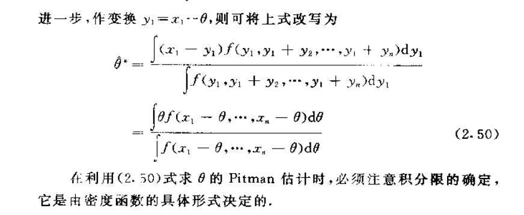
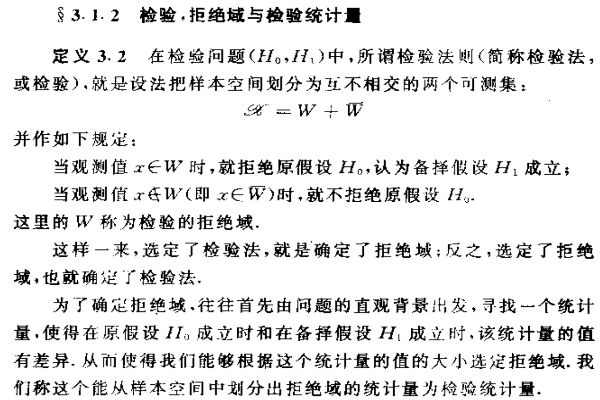
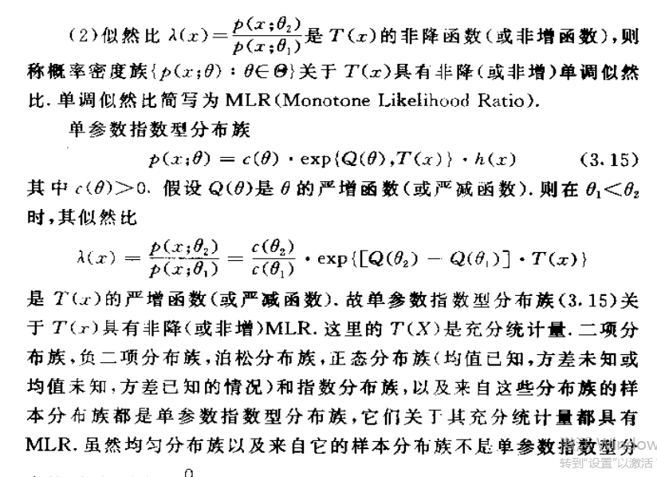
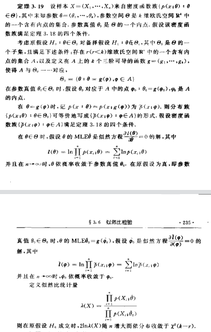
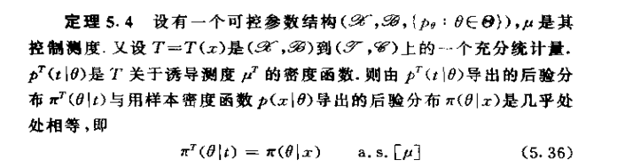

# AdvancedStatistics-Review
高等统计学复习

## 知识点地图

- 基本概念
  - 统计结构
    - 统计结构
        - 定义1.1
          - 
    - 乘积结构与重复抽样结构
    - 可控结构
      - 定义：存在测度能使概率函数对该测度绝对连续，导数为密度函数
      - 计数测度
      - 勒贝格测度
  - 常用分布族
    - Gamma分布族  
        - 定义1.6
          - 
    - Beta分布族
        - 定义1.7
          - 
    - Fisher Z分布族
        - 定义1.8
          - 
    - t分布族
        - 定义1.9
          - 
    - 多项分布族
    - 多元正态分布族
    - 几个非中心分布族
  - 统计量及其分布
    - 统计量
        - 定义1.14
          - 
    - 多项分布族
    - 抽样分布
      - 统计量的分布，由于经常使用雅克比变化，又称诱导分布
    - 来自正态总体的抽样分布
    - 次序统计量及其分布
      - 
      - 
      - 
  - 统计量的近似分布
    - 从中心极限定理获得渐进分布
      - 
    - 随机变量序列的两种收敛性
      - 
      - 
      - 
      - 
    - 几个重要的结构
    - 样本的p分位数及其渐进分布
  - 充分统计量
    - 统计量的压缩数据功能
      - 
    - 充分性
    - 因子分解定理
      - 
    - 最小充分统计量
      - 
  - 完备性
    - 分布族的完备性
      - 
    - 完备统计量
      - 
  - 指数结构
    - 定义与例子
    - 指数分布族的标准性质
    - 指数型分布族的标准形式
    - 指数型分布族的基本性质
- 点估计
  - 估计的优良性
    - 参数及其估计
    - 均方误差
      - $MSE_{\theta}(\hat{\theta}) = Var(\hat{\theta}) + (E(\hat{\theta}) - \theta)^2$
    - 无偏向
      - 定义
        - $E_{\theta}(\hat{g(X)})=g(\theta)$
      - 渐进无偏性
        - $lim_{n->\inf}E_{\theta}(\hat{g(X)})=g(\theta)$
    - 相合性
      - 弱相合（依概率）
      - 强相合 (a.s.)
      - 定理2.1
        - 
    - 渐进正态性
  - 无偏估计
    - 无偏性
    - UMVUE一致最小方差无偏估计
      - 引理2.2
        - 
      - 定理2.3
        - 
      - 如何求UMVUE
        - 方法一:寻找完备充分统计量的函数使之成为g(theta)的无偏估计
        - 方法二:任取g(theta)的一个无偏估计并将之对完备充分统计量求条件期望
    - 例题
    - U统计量（非参数）
      - 阶
      - 核
      - 对称核
      - 完备充分统计量
  - 信息不等式
    - Fisher信息量
      - 定义
        - 
      - CR正则族
        - 
      - 定理2.4
        - 
    - Fisher信息与充分统计量
      - 定理2.5
        - 
    - 信息不等式
      - 定理2.6
        - 
    - 有效无偏估计
      - 定理2.7
        - 
  - 矩估计与替换方法
    - 矩估计
      - 
      - 矩法估计不唯一
      - 原则是涉及的矩的阶数尽可能小，所用的估计最好是(最小)充分统计量的函数
    - 矩估计的特点
      - 样本越大，性质越优良
      - 矩法没有使用总体分布信息，是一种非参数方法（但其实推导函数和等式关系时利用了总体分布信息，但是估计矩本身其实就不用参数信息）
      - 相合性与渐近分布
        - 
    - 频率替换估计
      - 分箱+无限逼近
  - 极大似然估计（MLE）
    - 定义与例子
      - 不变性$g(.)$
    - 相合性与渐进正态性
      - 定理2.13大样本似然有解且相合
        - 
      - 定理2.14CR正则族条件下渐进正态
        - 
    - 渐进有效性
    - 局限性
      - 离散
      - 边界与参数有关的
  - 最小二乘估计（BLE）
    - 最小二乘估计
      - 
    - 最好线性无偏估计（BLUE）
      - 
    - 加权最小二乘估计
      - 不满秩的改进条件
      - 
  - 同变估计
    - 有限估计
    - 同变估计
      - 在样本发生线性变化后，估计量发生的变化要和参数的变化保持一致
      - 
    - 位置参数的同变估计
      - 
    - 尺度变换下的同变估计
      - 
    - 最好线性同变估计
- 假设检验
  - 基本概念
    - 假设
      - 
    - 检验、拒绝阈与检验统计量
      - 
    - 两类错误
      - $\alpha$第一类：拒真--当原假设成立，样本落到拒绝域
      - $\beta$第二类：纳伪--当原假设不成立，样本没落到拒绝域
    - 势函数
      - 
    - 检验的水平
      - 
    - 检验函数和随机化检验
      - 
    - 充分性原则
      - 
  - Neyman-Pearson基本引理
    - MPT最优势检验定义：对应简单假设场景
    - NP引理
      - 
    - 构造似然比检验
      - 
    - 定理3.3拒绝阈边界点性质
      -  
  - UMPT一致最优势检验
    - UMPT一致最优势检验:对应复杂假设场景
      - 存在性定理
        -  
      - 如何证明
        -  
      - MPT-UMPT的关系
        - 拒绝阈表达式(似然比)不依赖于参数$\theta_1$时可以适当扩大备择假设
        - 当势函数是单调函数时，可以适当扩大原假设
      - 单边与双边的分类
        -  
    - MLR单调似然比
      -  
      -  
      -  
    - 单边假设检验
      -  
      -  
    - 双边假设检验
      -  
    - N-P基本引理的推广（一）
    - 单参数指数型分布族的双边假设检验问题（一）
      - 
      -  
  - 一致最优势无偏检验
    - 无偏检验
    - 相似检验
    - N-P基本引理的推广（二）
      -  
    - 单参数指数型分布族的双边假设检验问题（二）
      -  
  - 多参数指数型分布族的假设检验
    - 多参数指数型分布族
    - 多参数指数型分布族的假设检验
      -  
    - 两个Poisson总体的比较
    - 两个二项总体的比较
    - 正态总体参数的检验问题
      -  
  - 似然比检验
    - 似然比检验
    - 简单原假设的检验问题
      -  
    - 复合原假设的检验问题
      -  
    - 二维列联表的独立性检验
    - 三维列联表的条件独立性检验
  - U统计量检验
    - U统计量
    - U统计量的期望和方差
    - U统计量的渐进正态性
    - 两样本U统计量
- 区间估计
  - 基本概念
    - 区间估计
    - 区间估计的可靠性
      - 
    - 区间估计的精确度
      - 区间的范围不能太大
      - 区间包含非真值的情况尽量少
    - 置信水平
      - 
    - 置信限
      - 
    - 置信域(多参数)
  - 构造置信区间的方法
    - 枢轴量法
      - 
    - 基于连续随机变量构造置信区间
      - 考虑待估参数的MLE或充分统计量，去除分布中的参数部分即可得到枢轴量
        - 
    - 基于离散随机变量构造置信区间
    - 区间估计与假设检验
    - 似然置信域：由似然比检验拒绝域构成的置信区间
  - UMA一致最精确的置信区间
    - UMA一致最精确的置信区间
      - 
    - UMAU一致最精确的无偏置信限和无偏置信区间
      - 
      - 
      - 
    - 置信区间的平均长度
      - 
  - 信仰推断方法:依赖于噪音建模方法
    - 信仰分布
    - 函数模型
      - 
    - Behrens-Fisher问题
- 统计决策理论与Bayes分析
  - 统计决策问题(后果与博弈)
    - 决策问题
      - 定义
        - 
      - 利用的信息
        - 先验信息
        - 样本信息
    - 统计决策问题的三个基本要素
      - 
    - 常用损失函数
      - 平方损失函数
      - 线性损失函数
      - 0-1损失函数
      - 多元二次损失函数
  - 决策函数和风险函数
    - 决策函数（样本空间->行动空间）
      - 
    - 风险函数（损失函数关于样本分布的数学期望）
      - 
      - 
    - 经典统计推断三种基本形式再描述
      - 点估计
        - 行动空间就为参数空间
        - 平发损失-均方误差-UMVUE
      - 区间估计
        - 行动空间为某个给定的区间类
        - 决策函数是定义为根据样本从区间类中取区间的函数
      - 假设检验
        - 行动空间为0-1
        - 决策函数根据样本是否选择原假设的0-1行动值
    - 最小最大估计
      - 
    - 随机化决策函数
      - 
    - 随机化决策函数的风险函数
      - 
  - 决策函数的容许性
    - 决策函数的容许性
      - 
    - Stein效应
      - 在二次损失函数下，p>=3是，样本均值向量是正态均值向量的非容许估计
    - 单参数指数族中的容许性问题
      - 
    - 最小最大估计的容许性
      - 
  - Bayes决策准则
    - 先验分布
    - Bayes风险准则（风险函数的平均期望，风险函数本身就是损失函数对数据的积分）
      - 
    - Bayes公式
      - 
    - 共轭先验分布
      - 
    - 后验风险准则（损失函数对后验分布取期望）
      - 
      - 
  - Bayes分析
    - Bayes估计
    - Bayes估计的性质
      - 
      - 
      - 
      - 
      - 
      - 
      - 
    - 无信息先验分布
      - 
    - 多层先验分布
      - 
    - 可信域
      - 
- 统计计算方法
  - 随机数的产生
    - 逆变换法
    - 合成法
    - 筛选抽样
    - 连续分布的抽样方法
    - 离散分布的抽样方法
    - 随机向量的抽样方法
  - 随机模拟计算
    - 统计模拟
    - 随机投点法
    - 样本平均值法
    - 重要抽样方法
    - 分层抽样方法
    - 关联抽样方法
  - EM算法及其推广
    - EM算法
    - 标准差
    - GEM算法
    - Monte Carlo EM算法
  - Markov Chain Monte Carlo(MCMC)方法
    - 基本思路
    - 满条件分布
    - Gibbs抽样
    - Metropolis-Hastings方法
    
  

## 课本习题重问法

- 习题一
  - 统计问题的统计结构
    - 1.2
    - 1.56
  - 证明结构是可控的
    - 1.3
  - |J|变量变化，算P
    - 1.5
    - 1.10
    - 1.12
    - 1.15
    - 1.23
    - 1.27
  - |J|变量变化，算E和Var
    - 1.10
  - 贝叶斯公式
    - 1.7
  - 特殊分布（卡方、beta、F、t） 概率与分位数计算
    - 1.8
    - 1.16
  - F(x)作为随机变量
  - 正态与变化矩阵与伪矩阵
  - 1.24证明题
  - 正态加概率分解等于独立
    - 1.26
  - 联合分布与边际分布的计算
    - 1.29
  - 分位数样本量的分布和联合分布
    - 1.35
  - 渐近分布
    - 1.36
  - 充分统计量证明与因子分解定理
    - 1.42
    - **1.44** 2019年考过
    - 1.49
  - 完备统计量
    - **1.54**
- 习题二
  - 证明估计的无偏性
    - 2.1
  - 求均方误差
    - **2.1**
    - **2.2**
    - 2.3
    - 2.9
  - 减小偏差的方法U统计量、jacknife方法
  - 相合性的判断
  - 习题2.10 伯努利分布的机会比率不可估:存在无偏估计的未知参数 
  - 求UMVUE
    - 2.11
    - **2.13**
    - **2.18**
  - 证明UMVUE不存在-遇事不决 定义+反证法
    - **2.19**
    - **2.23** 卡方分布性质
  - 求UMVUE的充分条件和必要条件：协方差与相关系数的关系
  - 求Fisher信息量
    - 2.24
  - 求CR下界
    - **2.25** 19年考过
    - **2.26** 神题
    - 2.27
  - 证明无偏估计的有效性
  - 求矩估计与相应的渐近分布（169）
    - 2.31
  - 求MLE
  - MLE、UMVUE和LSE的关系
  - 求MLE的渐近效
  - 求BLUE
    - **2.47**
    - 2.48
  - 求最优同变估计
    - 2.49
    - 2.50
- 习题三
  - 假设检验定义
    - **3.1**
  - 求MPT:似然函数、求似然比、证明关于T严格单调（MLR）、利用T的分布来满足置信度的要求
    - **3.2**
    - **3.3**
  - MPT的定义与性质
    - **3.4** 反证法
  - MLR性质与单参数指数族
    - 3.6
    - 3.7
    - 3.10
    - 3.11
  - 构造UMPT
    - 3.5
    - **3.8** 完备+MLR 则MPT是UMPT
    - **3.9** 定理3.8
  - 复合场景的UMPUT
    - 3.12
  - 多参数指数分布族的检验
    - 3.16
  - 正态总体的假设检验
    - **3.13** 卡方分布 t分布
    - 3.14
    - **3.15** 19年真题
  - 定理等式的证明
    - **3.17** 信息量的另一个式子
    - 3.25
    - 3.26
    - 3.27
  - 似然比检验
    - **3.18**
  - 列联表检验
    - 3.19
    - **3.20**
    - 3.21
    - **3.23**
    - 3.28
  - U统计量的检验
    - 3.24
- 习题四
  - 求平均长度最短的区间(精度最好)
    - 4.1
    - 4.2
  - 求给定置信水平的置信限与置信区间
    - 4.3
    - 4.4
    - 4.5
    - 4.6
    - 4.7
    - 4.8
  - 求UMA
    - 4.9
  - 求似然区间估计
    - 4.10
  - 求UMAU
    - 4.11
    - 4.12
  - Stein两阶段抽样方案的置信区间
    - 4.13
  - 信仰估计(与一般区间估计的一致性)
    - 4.14
    - 4.15
    - 4.16
- 习题五
  - 描述状态集、行动集合、收益矩阵
    - 5.1
    - 5.2
  - 损失函数
    - 5.2 
    - 5.3
    - 5.4
    - 5.5
  - 决策函数与风险函数
    - 5.6
    - 5.7
    - 5.8
    - 5.9
    - 5.11
    - 5.12
  -最小最大决策函数
    - 5.10
    - 5.49
  - 容许估计
    - 5.13
    - 5.14
    - 5.15
  - 求后验分布
    - 5.16
    - 5.17
    - 5.18
    - 5.19
    - 5.20
    - 5.23
    - 5.24
    - 5.26
    - 5.27
    - 5.28
    - 5.29
  - 共轭先验 
    - 5.21
    - 5.22
    - 5.25
    - 5.30
    - 5.45
  - 确定先验分布
    - 5.31
    - 5.32
    - 5.33
    - 5.44
  - Bayes估计
    - 5.34
    - 5.35
    - 5.38
    - 5.39
    - 5.40
    - 5.41
    - 5.43
    - 5.46
    - 5.47
    - 5.48
  - 后验统计量（均值、方差
    - 5.36
    - 5.37
    - 5.42
  - 无信息先验分布
    - 5.45
    - 5.49
  - 可信区间
    - 5.51
    - 5.52
    - 5.53
    - 5.54
- Young-Smith-Essentials of Statistical Inference
  - 决策函数与最小最大估计
    - No.1 解释图表 Finite decision problems(asmissible, minimax and Bayes decision rules)
    - No.4 2.3教堂山校区因雪关闭问题与admissible，minimax 和 Bayes rules
    - No.9 3.4Bayes rule and minimax 估计
    - No.23 给定loss function下的Bayes rule及minimax与否(定理2.2常数与否)
    - No.24 **新型飞机研发中的Bayes决策问题**
  - 容许估计的定义与推导
    - No.2 2.1确定合适的decision rule
    - No.6 2.5细菌的生长问题与指数分布，Bayes rule
  - 贝叶斯决策准则
    - No.3 2.2哈利波特的问题与Bayes decision rule
    - No.5 2.4与卫星对接火箭发射问题与Bayes rule
    - No.7 2.6-2.8Bayes rule与admissibility， minimax等的关系
    - No.22 **给定loss function下的Bayes rule**
  - 可信区间
    - No.8 3.3Bayesian interval estimate for the mean mu
    - No.31 **区间估计的Bayes方式下的一个结论(使用积分中值定理来证明不等式实现反证)**
  - 经验贝叶斯:即利用在贝叶斯规则下从X的边际分布中获得先验参数的信息，最终获得的贝叶斯估计
    - No.10 Empirical Bayes 想法在正态上的初步推导
    - No.11 用Empirical Bayes重新得到James-Stein估计
    - No.12 关于prior的讨论
      - Physical reasoning
      - Flat or uniform priors, including improper priors
      - Subjective priors
    - No.16 正态经验Bayes作为Hierarchical model
    - No.17 预测分布-使用baseball数据为例
    - No.18 煤矿矿难的数据Bayes分析:众数 后验分布峰值分析
    - No.19 基因表达数据的Bayes分析
    - No.20 求均值和众数
    - No.21 **投硬币游戏中的Bayes估计与预测**
    - No.27 **增量样本Bayes下条件均值与方差**
    - No.28 边际后验分布推导
    - No.29 求一个Bayes估计
    - No.32 **beta-binomial形式推导(全概率公式+双期望公式+条件方差公式)**
    - No.33 正态超参数后验分布的推导
    - No.34 正态超参数后验分布的推导及预测
    <!-- - No.35 Wishart下Bayes预测分布推导 -->
  - 贝叶斯统计计算
    - No.13 Gibbs sampler
    - No.14 Metropolis-Hastings离散空间
    - No.15 Metropolis-Hastings连续空间
- 假设检验

  

